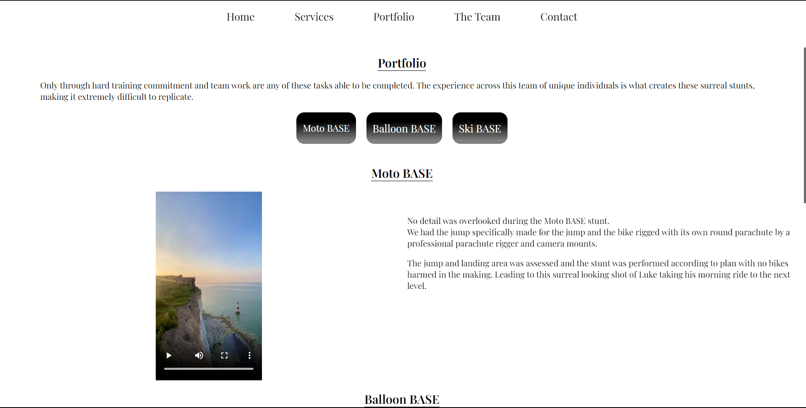

# MMB Stunt Team

[Live Site](https://basejumpproductions.com/services)

## TABLE OF CONTENT

- [Project Overview](#project-overview)
- [User Experience (UX)](#user-experience-ux)
  - [Client Goals](#client-goals)
  - [Design](#design)
    - [Colours Used](#colours-used)
    - [Typography](#typography)
- [Actual Features](#actual-features)
- [Technologies Used](#technologies-used)
  - [Languages, Frameworks, Libraries \& Programs Used](#languages-frameworks-libraries--programs-used)
  - [Testing and Accesibility](#testing-and-accesibility)
    - [Manual testing](#manual-testing)
- [Deployment](#deployment)
  - [Forking a Repository](#forking-a-repository)
  - [Cloning a Repository](#cloning-a-repository)
- [Contact](#contact)

## Project Overview

Mountain man BASE need a website for there new business venture. They want a website that promotes there services and acts as a place where team members can interact or update details. To achieve this I will be utilizing the many uses of a MERN stack.

## User Experience (UX)

**MMB clients**
A possible client for the business will be able to navigate the website using the header navigation to the main tabs, these are Home, Services, Portfolio, The Team, Contact. Easy contact can be made via email on the contact page.

**MMB team**
The team will be able to access the members area (protected routes) via a login screen. Here they will be able to use the groupchat area for the team members to coordinate business activities and a personal details page so they are able to change there details for possible stunt jobs. An admin will have access to all user details.

### Client Goals

- A website that represents the team and its goals. 
- It must have a clean look and feel
- A Portfolio page 
- Services page 
- Team page
- Contact page 
- Members area with a chatroom and personal details page
- An Admin can access all user details
  
## Design

### Colours used

- `black`
- `white`

### Typography

- Playfair Display (Regular, SemiBold, Bold)

## Actual Features

- **Home:** 

  
  

- **Services:** 

  

- **Portfolio:** 
  

- **Contact:** 
  

The members area is still in the works, This section will be updated once the app is completed.

## Technologies Used

### Languages, Frameworks, Libraries & Programs Used

- **Languages:**
  - **JavaScript (ES6+):** The primary programming language used for building the application logic and interactivity.

- **Frameworks & Libraries:**
  - **React:** A JavaScript library for building user interfaces, used for creating dynamic and responsive UI components. [React Documentation](https://reactjs.org/docs/getting-started.html)
  - **React Router Dom:** A library for adding routing functionality to a React application, facilitating navigation between different components. [React Router Dom Documentation](https://reactrouter.com/web/guides/quick-start)
  - **React Modal:** A flexible and accessible modal dialog component for React. [React Modal Documentation](https://github.com/reactjs/react-modal)
  - **React Datepicker:** A simple and reusable datepicker component for React. [React Datepicker Documentation](https://reactdatepicker.com/)
  - **React Player:** A React component for playing various media formats, such as videos and audio files. [React Player Documentation](https://github.com/cookpete/react-player)
  - **React Scroll:** A library for smooth scrolling to elements on the page in React applications. [React Scroll Documentation](https://www.npmjs.com/package/react-scroll)
  - **React Router Hash Link:** A library for smooth scrolling to hash links with React Router. [React Router Hash Link Documentation](https://www.npmjs.com/package/react-router-hash-link)
  - **FontAwesome:** A library for adding scalable vector icons to web projects. [FontAwesome Documentation](https://fontawesome.com/)
  - **Tailwind CSS:** A utility-first CSS framework for creating custom designs quickly. [Tailwind CSS Documentation](https://tailwindcss.com/docs)

- **Tools & Programs:**
  - **Create React App:** A tool for quickly setting up a new React project with a pre-configured build setup. [Create React App Documentation](https://create-react-app.dev/docs/getting-started/)
  - **EmailJS:** A service for sending emails directly from client-side JavaScript, useful for contact forms and other email-related functionalities. [EmailJS Documentation](https://www.emailjs.com/docs/)
  - **Code Quality Tools:**
    - **ESLint:** A tool for identifying and reporting patterns found in ECMAScript/JavaScript code, ensuring code consistency and identifying potential errors. [ESLint Documentation](https://eslint.org/docs/user-guide/getting-started)
    - **PostCSS & Autoprefixer:** PostCSS is a tool for transforming CSS with JavaScript plugins. Autoprefixer is a plugin to parse CSS and add vendor prefixes to CSS rules. [PostCSS Documentation](https://postcss.org/), [Autoprefixer Documentation](https://github.com/postcss/autoprefixer)
  

## Testing and Accesibility

### Manual testing

- All links to navigate the site were tested 
- Contact form works as expected

Members area is yet to be completed but will be thoroughly tested.

## Deployment

1. **Sign up for Vercel:** Create an account at [vercel.com](https://vercel.com/signup).

2. **Set up GitHub Repository:** Ensure your project is hosted on GitHub.

3. **Connect GitHub to Vercel:** 
   - Go to your Vercel dashboard.
   - Click "Import Project" and select your GitHub repository.
   - Configure deployment settings and click "Deploy."

4. **Configure Deployment Settings (optional):**
   - Create a `vercel.json` file in your project for custom settings.

5. **Add Deployment Badge to README:**
   - Find the deployment badge URL in your Vercel project settings.
   - Add the badge markdown to your README.

6. **Commit and Push Changes:**
   - Commit and push any changes to your GitHub repository to trigger a new deployment on Vercel.

### Forking a Repository

1.Log in to GitHub and locate the repository that you want to fork.

2.Click on the 'Fork' button found on the top right of the repository page.

3.Select the destination where you want to fork the repository.

4.After forking is complete, you'll be redirected to your forked repository.

### Cloning a Repository

1.On the GitHub repository page, click on the "Code" button and copy the repository URL provided.

2.Open your terminal and navigate to the directory where you want to clone the repository.

3.Use the 'git clone' command followed by the repository URL you copied and press 'Enter'

## Code

- Youtube tutorials were used.These tutorials were instrumental in helping me understand how to effectively use Sanity in the development.

## Contact
For any inquiries or feedback regarding the UK BASE Jumping Map application, please contact the project maintainer at jakelewisorton@gmail.com